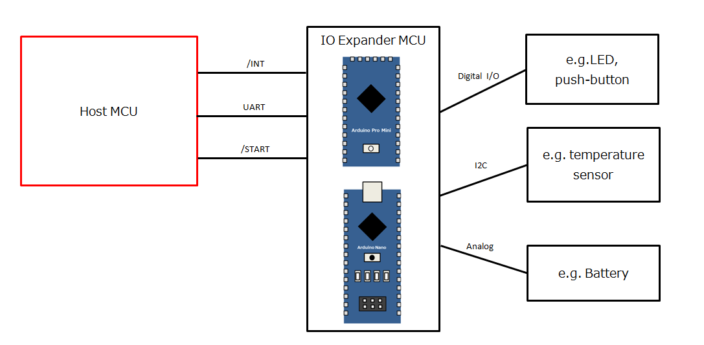

# arduino-ioexpander-lib
Host Library with Arduino for [arduino-ioexpander-fw](https://github.com/bigw00d/arduino-ioexpander-fw)

## Overview

  

## Installation
1. Download the zip file.
2. Move the zip file to your libraries directory.
3. In the Arduino IDE, navigate to Sketch > Include Library > Add .ZIP Library.
4. Select the zip file.

## Usage 
1. Programming arduino-ioexpander-fw to your IO expander device (see [arduino-ioexpander-fw](https://github.com/bigw00d/arduino-ioexpander-fw))
2. Connecting Host device to IO expander device(see [arduino-ioexpander-fw](https://github.com/bigw00d/arduino-ioexpander-fw))
3. Start IO expander device 
4. Start Host device

## Example

```IOExpanderDemo.ino
#include "ArduinoIOExpander.h"

ArduinoIOExpander expander;

void setup()
{
    Serial.begin(115200);
    expander.init();
}

void loop()
{
  // still in preparation
  delay(1000);
}

```
